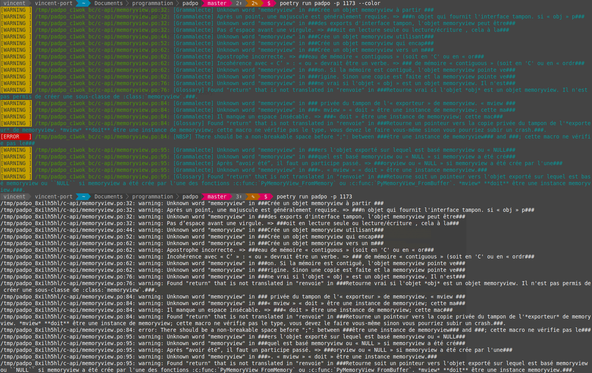

# padpo

[](https://pypi.python.org/pypi/padpo)
[](https://github.com/vpoulailleau/padpo/blob/master/LICENSE)
[](https://travis-ci.com/vpoulailleau/padpo)
[](https://github.com/ambv/black)
[](https://pepy.tech/project/padpo)
[](https://codeclimate.com/github/vpoulailleau/padpo/test_coverage)
[](https://codeclimate.com/github/vpoulailleau/padpo/maintainability)

Linter for gettext files (*.po)

Created to help the translation of official Python docs in French: https://github.com/python/python-docs-fr

Il faut demander aux traducteurs s'ils n'ont pas de pot quand ils traduisent, maintenant ils ont `padpo`…
:smile: :laughing: :stuck_out_tongue_winking_eye: :joy: (note : il était tard le soir quand j'ai trouvé le nom).

**WORK IN PROGRESS**

## License

BSD 3-clause

Pull request are welcome.

## Usage

Using the *activated virtual environment* created during the installation:

For a local input file:

```bash
padpo --input-path a_file.po
```

or for a local input directory:

```bash
padpo --input-path a_directory_containing_po_files
```

or for a pull request in python-docs-fr repository (here pull request #978)

```bash
padpo --python-docs-fr 978
```

or for a pull request in a GitHub repository (here python/python-docs-fr/pull/978)

```bash
padpo --github python/python-docs-fr/pull/978
```



### Color

By default, the output is colorless, and formatted like GCC messages. You can use `-c`
or `--color` option to get a colored output.

## Installation

### Automatic installation

```bash
pip install padpo
```

### Manual installation

1. Install dependencies

   ```bash
   poetry install
   ```

   Note: this uses `poetry` that you can get here: https://poetry.eustace.io/docs/

2. Use virtual environment$

   ```bash
   poetry shell
   ```

## Update on PyPI

`./deliver.sh`

## Changelog

### v0.9.0 (2020-09-07)

* use `pygrammalecte` default message for spelling errors

### v0.8.0 (2020-08-25)

* use [`pygrammalecte`](https://github.com/vpoulailleau/pygrammalecte)
* add continuous integration
* fix #12, #13, #14, #15, #17, #18, #20
* add `--color` CLI option to get a colored output (default is colorless)

### v0.7.0 (2019-12-11)

* add `--version` CLI option to display the current version of `padpo`
* `--input-path` CLI option now accepts several paths as in
  `padpo --input-path file1.po file2.po directory1 directory2` or
  `padpo -i file1.po file2.po directory1 directory2`

### v0.6.0 (2019-12-9)

* check errors against defined glossaries

### v0.5.0 (2019-12-3)

* check spelling errors with grammalecte
* tag releases!

### v0.4.0 (2019-12-2)

* use poetry: https://poetry.eustace.io/docs/
* add some tests with tox and pytests
* fix some false positive issues with grammalecte
